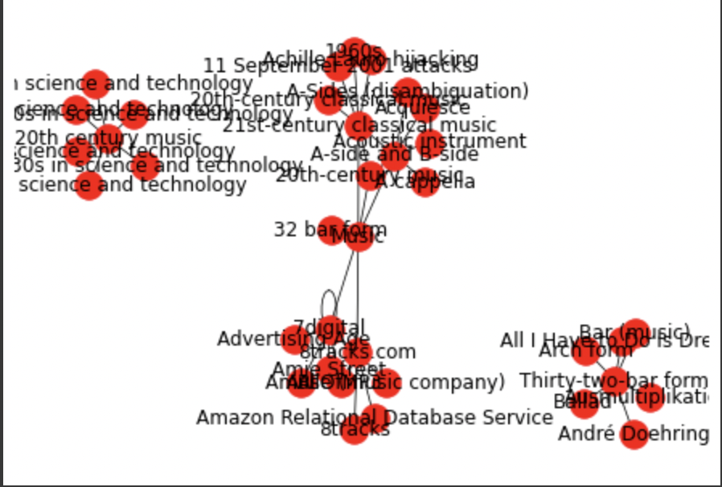
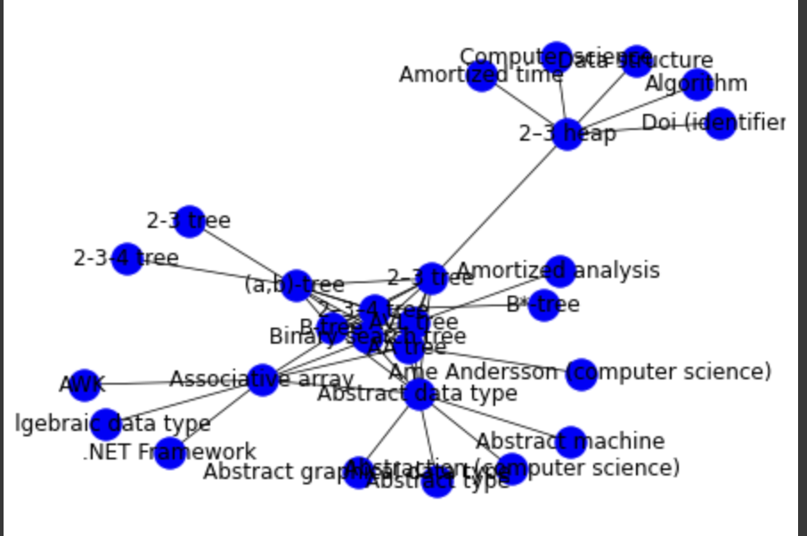
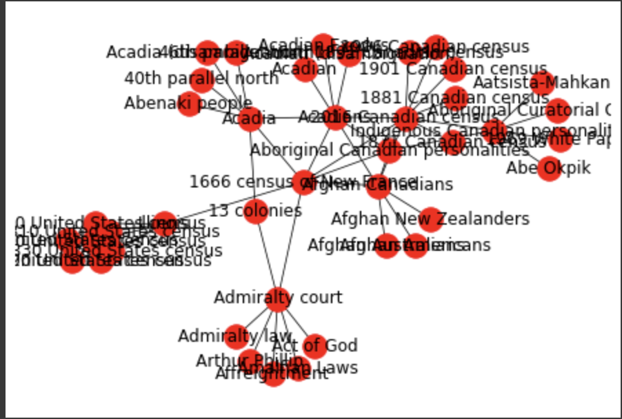

# Wikipedia Graph Visualizer

This repository contains the code that was started as the group Sheep's CS128 Final Project. (Gautam, Steven, Dexin)

The notebook used for visualization in Milestone 2 is linked [here](https://colab.research.google.com/drive/1yhzumLYrf2ZYP0uOS4iKL4D-Yqyl_CnP#scrollTo=ge44kHU_AToS)

## Building the Project
In the root directory of our repository, you will find a `requirements.txt` file. Regardless of whether you are working in a VM or locally, you can install all the dependencies as follows (assuming that you have pip already installed).

```
$ pip -r requirements.txt
```

No additional building is required since we are working with Python.

## Using our Visualizer

### Command Line Arguments
Our program takes in three command line arguments:
* The title of the source page. This will be the root node of the graph that will be generated.
* The the depth of the desired graph. This represents how many consecutive pages the program will go through.
* The breadth of the desired graph. This represents how many links per page the program will add to the graph.

## Example Graph Plots
The below plots were generated using the program.

### Root node: Music



### Root node: Binary Search Tree



### Root node: Illinois



## Running the Test Suite

The tests were written with the `unittest` python module that assists in developing a test framework. Run `src/test_simple.py` to see the test cases pass. There are tests with difference root nodes, breadth parameters, and depth parameters. If test cases don't pass or you get a dependency error, make sure you have downloaded all required libraries from the `requirements.txt` file.

## Interesting Things to Try
* Finding unintuitive connections between seemingly unrelated topics.

## Future Work

* Detecting cycles in the wikipedia graph
* Checking how much depth it takes for ANY wikipedia page to reach Philosophy. See [getting to philosophy](https://en.wikipedia.org/wiki/Wikipedia:Getting_to_Philosophy).
* Built-in [wikiracing](https://en.wikipedia.org/wiki/Wikiracing) functionality
* Other games involving guessing the distance between two nodes and scoring based on accuracy
